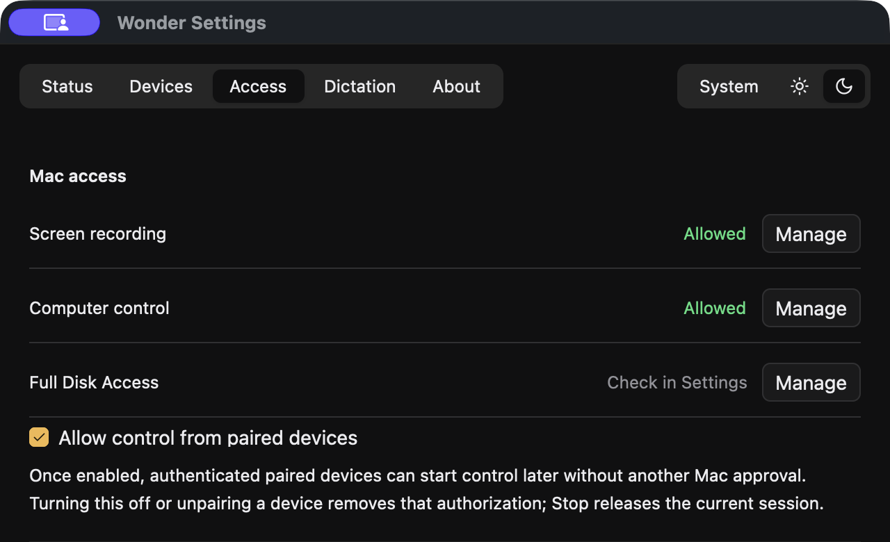
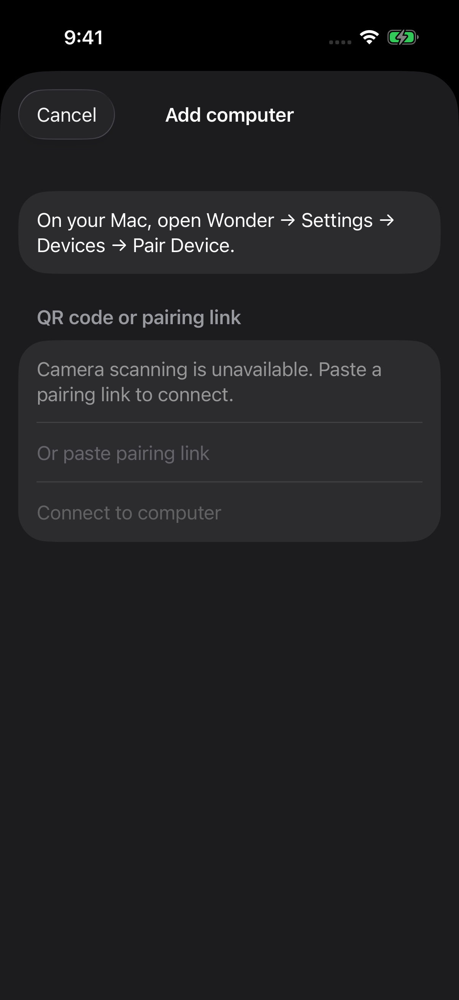

# Set up Wonder

Wonder runs on your Mac and connects to its native iPhone or iPad app over
Tailscale. There is no Wonder account. Allow about one setup session with both
devices nearby; the Mac must confirm the phone’s first connection.

The [signed Mac beta installer](https://github.com/swaymun/wonder/releases/download/mac-v1.0.63-beta.1/Wonder-1.0.63.dmg)
is available. Its SHA-256 checksum is
`d640c2a1393f24102589349e82f2c711e08ebe76cc000ddb186761c0d554525c`.
External TestFlight enrollment is awaiting Apple review and device qualification.
Developers can also use the [source-build instructions](DEVELOPMENT.md).

## Requirements

| You need | Details |
| --- | --- |
| Mac | Apple Silicon; macOS 14 or later is the deployment target. |
| iPhone or iPad | iOS/iPadOS 17 or later is the deployment target. |
| ChatGPT Desktop | The Mac runtime must be a version listed in `compatibility-manifest.json` (`0.155.0-alpha.9`, `0.155.0-alpha.9.2`, or `0.155.0-alpha.16.3`), with its matching schema and code-mode helper. Wonder checks this automatically. |
| Model access | Sign in to your model provider using the supported runtime. Its access limits and billing still apply. |
| Tailscale | Install on both devices, join the same tailnet, and allow access between them. MagicDNS and tailnet HTTPS must be enabled. |

Deployment targets are not a claim that every OS combination has been tested.
The [release process](RELEASING.md) separates supported deployment targets from
installation and device qualification. Public vendor-download compatibility and
fresh installation remain release gates; do not install an arbitrary older runtime
from an unofficial source.

## 1. Install the runtime

Download [ChatGPT Desktop from OpenAI](https://chatgpt.com/download/), put it in
Applications, and sign in. Use the desktop app that includes Codex, rather than
ChatGPT Classic. Wonder uses the installed runtime without modifying or bundling it.

If Wonder reports an incompatible runtime, stop at that message and check the
current Wonder release requirements. Reinstalling Wonder or resetting its data
will not fix a version mismatch. Do not bypass the compatibility check.

## 2. Connect Tailscale

Install [Tailscale](https://tailscale.com/download) on the Mac and phone, sign in,
and connect both to the same tailnet. If the tailnet belongs to an organization,
its administrator may need to enable HTTPS or allow the devices to communicate.

Wonder uses private [Tailscale Serve](https://tailscale.com/docs/features/tailscale-serve),
not public Funnel. It configures its own unused HTTPS port and preserves unrelated
Serve configuration. The default is port 8443, forwarding to the Mac’s local service.

## 3. Install Wonder on the Mac

1. Download the signed DMG from the release linked in the README.
2. Open it and drag **Wonder** into **Applications**.
3. Open Wonder from Applications, then eject the disk image.
4. Follow setup and choose **Connect Tailscale**.

To repeat setup on an existing installation, open **Wonder → Settings → Status →
Review setup…**. This keeps your conversations, paired devices, folders and
launch-at-login preference.

The official installer is signed and notarized. If macOS reports a damaged or
unverifiable download, download it again from the official release and report the
problem. Do not disable Gatekeeper or strip security attributes.

## 4. Choose permissions

Screen viewing needs **Screen Recording**. Computer control also needs
**Accessibility** and an unlocked Mac. Grant only the features you want; choose
workspace folders through Wonder’s normal folder controls. Follow any macOS prompt
to reopen Wonder after changing a permission.

Setup asks which screen to share when your Mac has multiple displays. Skip the
choice to use the main display. You can change it later in **Settings → Access →
Screen to share**; if a chosen display is disconnected, Wonder uses the main one
until it returns. Your choice stays saved when Wonder updates.

On-device dictation is optional and downloads its model separately. At the end of
setup you can enable launch at login. The Mac still needs to stay awake and online.

## 5. Pair your phone

1. Follow the official TestFlight invitation from the README and install Wonder.
2. Keep Tailscale connected on both devices.
3. On the Mac, open **Wonder → Settings → Devices → Pair Device**. First-run
   setup also offers **Connect your phone**.
4. In Wonder on the phone, add a connection and scan the Mac’s code, or paste its
   pairing link if scanning is inconvenient.
5. Compare the verification codes and approve the request on the Mac.

Pairing codes and links are private and expire. The screenshot intentionally shows
the phone before entering one. Never post your code in an issue or share it with
someone you do not want to authorize. Tailnet membership alone does not pair a device.

## 6. Open a conversation

Create or open a Bot, then send a first request. Start with something harmless,
such as “Help me plan tomorrow.” Group Chats let you bring multiple Bots into one
conversation. Requests needing approval appear in the conversation.

In the connection’s settings, turn on **Notifications** if wanted. The switch
saves your preference immediately. Temporary setup failures retry quietly while
Wonder is open and when reopened; denied permission turns it off and offers
Settings. Delivery starts after registration succeeds. Background setup retries
are not guaranteed. Turning notifications off leaves chat usable.

Reply, approval, and question previews are encrypted before reaching the push
service. iOS preview settings still apply, and Wonder stays quiet in the foreground.
Opening a notification reconnects to the Mac to resolve the conversation.

## Troubleshooting

| What you see | What to do |
| --- | --- |
| Runtime unavailable or incompatible | Check that the supported ChatGPT Desktop is in Applications and signed in. Compare the version requirements above; keep Wonder’s compatibility checks enabled. |
| Tailscale needs login or is offline | Open Tailscale on both devices and connect to the same tailnet. Check the tailnet’s device-access rules. |
| HTTPS or Serve setup fails | Follow Wonder’s specific error. Enable tailnet HTTPS/MagicDNS if requested. If another service uses Wonder’s port, resolve that conflict without resetting unrelated Serve configuration. |
| Phone cannot find the Mac | Keep Wonder running and the Mac awake. Reconnect Tailscale, then retry the existing connection before pairing again. |
| Pairing code expired | Create a new code on the Mac and repeat the confirmation. |
| Screen is unavailable or control does nothing | Check Screen Recording and Accessibility on the Mac. Unlock the Mac and reopen Wonder if macOS requests it. |
| Notification permission denied | Open iPhone Settings → Notifications → Wonder, allow notifications, then enable the Wonder toggle again. |
| Notification opens an offline conversation | Wake the Mac, reconnect Tailscale, and use the notification’s retry action. |

If reporting a problem, include the Wonder and OS versions and a description using
synthetic data. Do not attach database files, tokens, pairing links, or private
screenshots. See [security reporting](SECURITY.md).

## Updates

After setup, Wonder offers automatic update checks. In **Settings → Status →
Updates**, choose whether to check automatically and download updates. You can
also choose **Check for Updates…** at any time. These preferences survive relaunch.
Updates are signed and verified before installation. Wonder waits for active work
and computer sharing to finish, then restarts to install the update.

You can still update manually: download the newer signed DMG, quit Wonder, replace
the app in Applications, and reopen it. Both update paths preserve the separate
data folder; never delete that folder to update. Check that your conversations
and phone connection return. On iPhone and iPad, updates are managed by TestFlight.
Automatic installation remains under qualification. If an update does not
complete, install the latest signed DMG from the Mac release page.
See [beta status](BETA_STATUS.md) for which update paths have been qualified.

The Mac data folder is `~/.wonder`. Do not repair pairing by editing SQLite or
deleting Keychain entries.

## Building your own apps

See [DEVELOPMENT.md](DEVELOPMENT.md) for prerequisites and Mac build commands.
The official TestFlight app can pair with a source-built Mac and use Wonder’s
push service.

If you build or re-sign iOS under your own Apple identity, configure both the main
app and Notification Service Extension identities, their shared Keychain access,
provisioning, and matching APNs environment. You also need your own APNs key and
push Worker. Follow [the push deployment guide](services/push/README.md); keep
private keys in service secrets, never in an app or Git.

## Uninstalling

Turn off launch at login in Wonder, revoke paired devices you no longer want to
authorize, then quit Wonder and move the app from Applications to Trash. App removal
does not delete your conversations or credentials. Keep the data folder if you
might reinstall. Deleting `~/.wonder` also deletes local conversations and credentials.

Removing Wonder does not uninstall Tailscale or reset its configuration. Remove
only Wonder’s Serve entry if no longer needed; preserve your other services. Remove
the phone app through iOS normally. Independently deployed push services and Apple
keys remain your responsibility to retire when they have no remaining clients.
