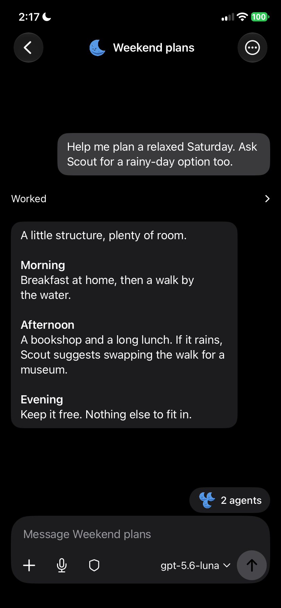
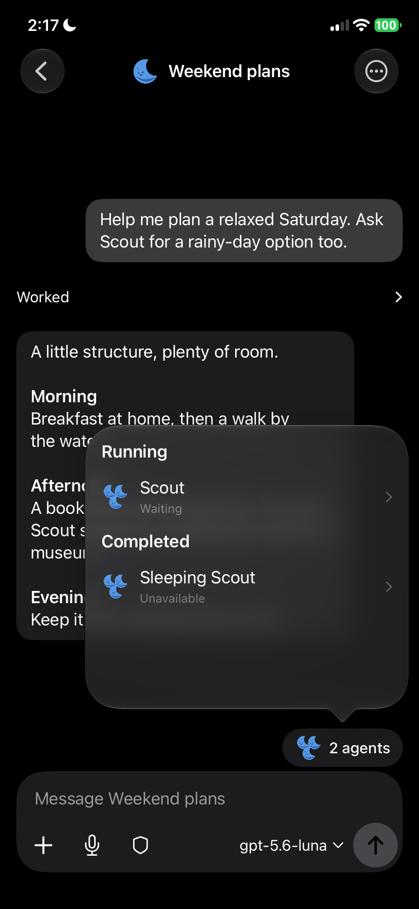
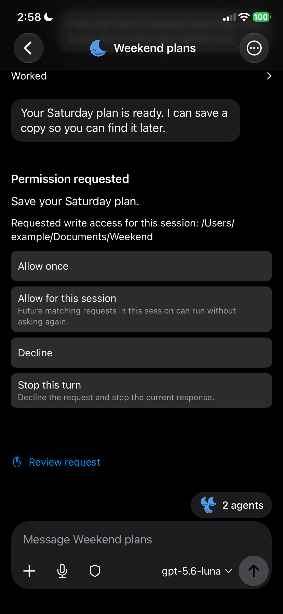

  

<h1 align="center">Wonder</h1>

<strong>Your Mac’s agents, on your iPhone and iPad.</strong>

Keep a conversation going, review a request, or check your Mac from your phone.

<strong>Mac download — preparing beta</strong> · <strong>TestFlight — external access pending</strong> · <a href="INSTALL.md">Setup guide</a>

Wonder is a native iPhone and iPad messenger for agents running on your Mac. Give
work to a Bot, bring Bots together in a Group Chat, and return to the same
conversations, files, and decisions later. Your Mac hosts Wonder; your devices
connect through your own Tailscale network.

**Public beta is being prepared.** The installer and public TestFlight invitation
will appear here after first-install and device qualification. Source builds are
available from this repository. [Release qualification](RELEASING.md).

## Keep your work with you

| Follow the helpers | Requests you can act on |
| --- | --- |
|  |  |
| See each helper’s status above the composer, then open its work without leaving the parent conversation. | Review the requested action and choose how much permission to grant. |

Answer questions and review approval requests from your phone. Permission choices
remain explicit, with server-confirmed settings applied before work starts.

**Remote screen access:** view your Mac and, with permission, control it from Wonder. Screen/control recovery qualification remains part of the beta checks.

Screenshots use demo content in Wonder’s native views. They contain no personal
conversations. [Screenshot provenance](assets/screenshots/README.md).

## Set up your Mac and phone

You need an **Apple Silicon Mac**, an **iPhone or iPad**, a supported **ChatGPT
Desktop runtime**, and **Tailscale on both devices**. Wonder’s deployment targets
are macOS 14 and iOS/iPadOS 17; see the [supported configuration](INSTALL.md#requirements)
for the tested combinations and exact runtime requirement.

1. Install the supported runtime and sign in to your model provider.
2. Connect your Mac and phone to the same Tailscale network.
3. Install Wonder on both devices, scan the Mac’s pairing code, and confirm on the Mac.

[Follow the setup guide →](INSTALL.md)

## Your Mac hosts Wonder

- **No Wonder account.** Pairing requires your confirmation on the Mac. Joining
  the tailnet alone does not grant access to your conversations or computer.
- **Local history and files.** Wonder stores conversations and attachments on
  your Mac, with local copies on paired devices. Agent requests and any content
  needed for them go to your chosen model provider under that provider’s terms.
- **Your network.** Tailscale carries the connection; screen sharing uses direct
  WebRTC. Wonder operates no chat or screen relay. Tailscale may use its encrypted
  relay fallback.
- **Optional notifications.** Replies, approvals, and questions can show encrypted
  previews, subject to your iPhone’s preview settings. Wonder suppresses alerts
  while the app is in the foreground. The push service forwards ciphertext and
  retains device tokens, authorization records, and limited delivery metadata;
  it does not receive plaintext previews, files, or screenshots.

Wonder has no subscription or model credits. Model access and any Tailscale plan
are your responsibility. The official TestFlight app uses Wonder’s push service,
including with a source-built Mac host. If you sign your own iOS app, you need
[your own Apple push configuration and Worker](services/push/README.md).

## During the beta

Keep the Mac awake, online, and running Wonder for new work and remote access.
Mac updates use signed manual downloads. Automatic updates are unavailable.
Runtime compatibility is deliberately checked; an unsupported runtime will not
run agent work. Teaching replay and the remaining device/recovery checks are
tracked in the release status and are not claimed as qualified here.

[Build from source](DEVELOPMENT.md) · [Security reporting](SECURITY.md) ·
[Release process](RELEASING.md) · [MIT license](LICENSE) ·
[Third-party notices](THIRD_PARTY_NOTICES.md)
